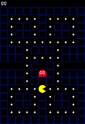

# Pac-Man with Python and git 2
Some sick changes yo!

Pac-Man clone made for the purpose learning/teaching Python and git/github.

The game has shortcomings as a game and as a software project,
some purposely made for the sake of learning/teaching.



## Installation
1. Clone this repository 

2. Install the pygame module:

   ```pip3 install pygame```

3. Run `game.py`
